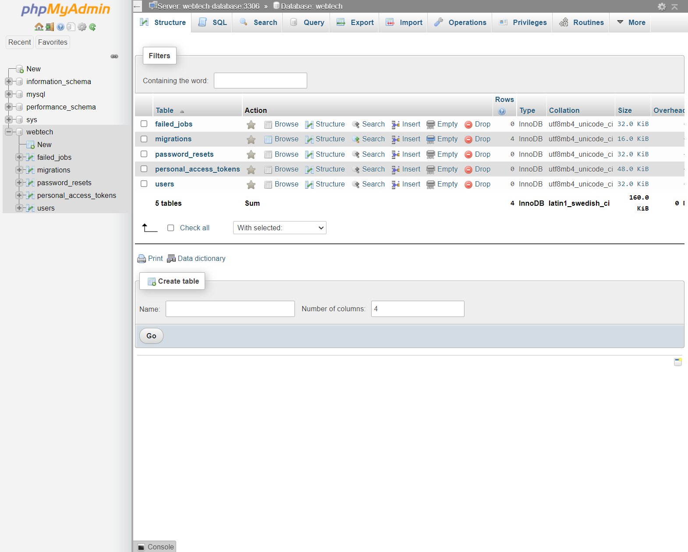
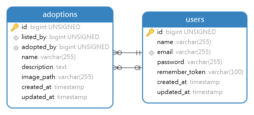

# Assignment 2: Pet Shelter

In the previous assignment, you created a minimal version of *itslearning*, where you learned how to build your own web application using MVC. In this application, you will implement authentication and authorization features in another application: a pet shelter board.

The pet shelter board is an application where registered users can post pets they are giving in for adoption. Moreover, registered users can also adopt pets posted by other users.

You must follow the instructions **to the letter**, your application will be tested automatically by the same system of the previous assignment (Please be patient, we are improving the system right now). This time, we are going to provide you with a base application, where all the main components that you learned from the previous assignment are already implemented. Your job is to implement the components in charge of the authentication and authorization features.

This assignment can be done individually or in groups of two people. Because of the time constraint of the assignment and [pair programming practices](https://en.wikipedia.org/wiki/Pair_programming), we heavily encourage you to work in groups. To create groups, you have to use the group feature in our automatic testing application (*ie,* it is not necessary to create groups in itslearning). If you want to work in pairs but you do not know anyone else in the course who wants that, you can use the dedicated channel in Discord to look for a partner.

**Disclaimer:** Unless otherwise instructed, do not in any way, modify the contents of the `/tests` directory or the `.gitlab-ci.yml` file. Doing so will be considered cheating, and will in the best case result in your assignment being failed.
**We have seen projects that changed some of these files in the previous assignment. For this assignment, we are going to be more strict.**

## Setup

1. Clone your project locally.
2. Run `composer install` to install php dependencies.
3. Create a copy of the .env.example file named .env. This can be done with the command `cp .env.example .env`
4. Run `php artisan key:generate` to generate a random encryption key for your application
5. Run `php artisan serve` to boot up your application

### The project

In this assignment, you are given an already coded application, where you have to fill up the gaps in the source code. This means,it is not necessary for you to create any file, although you can create files if you think they are needed for your application to pass the tests. The different files you need to modify to pass this assignment are listed in its correspondent section.

### The database
The project requires a connection to a database. Luckily, thanks to docker, this is extremely simple and platform agnostic. To spin up a MySQL server, simply run the `docker-compose up -d` within the directory. This will pull a MySQL server, port-forward it to port 3306 on your machine, and start it in detached mode. 

Additionally, we have included an installation of _phpmyadmin_ that you can use to explore the database (this will start as part of the docker command), simply go to [http://localhost:8036](http://localhost:8036) and you should see something like this:

(if the database is empty, you haven't migrated it yet)

You are of course still free to use whichever tool you prefer.

The connection to the database is defined as follows:
- host: `localhost`
- port: `3306`
- username: `root`
- password: `secret`
- database: `adoption`

If you followed the steps mentioned earlier and copied your `.env.example` to `.env`, then Laravel should already be configured with the correct connection details.

_Hint: your JetBrains Student subscription comes bundled with __DataGrip__, which can be used to explore your database._

### Relevant commands

- `php artisan migrate` - This will synchronize your database structure to your migrations (read more [here](https://laravel.com/docs/8.x/migrations#introduction)), these can be viewed under `database/migrations`. Laravel comes bundled with some by default, which you can either ignore or delete.
- `php artisan migrate:fresh` - Deletes everything within your database and starts the migration from scratch, very useful during development.
- `php artisan migrate:fresh --seed` - Deletes everything within your database and starts the migration from scratch, and seeds the database with some dummy data and cute animals.
- `php artisan make:controller {name of Controller}` - This creates a controller with a specified name. Controllers in Laravel use a singular noun with the `Controller` suffix (HomeController, UserControler... e.g.)
- `php artisan make:model {name of model}` - Creates a model with a specified name (usually singular (User, House, Apartment, Animal...))
- `php artisan make:model {name of model} -mr` - Allows us to create a model with a given name, as well as a controller for it and a migration.
- `php artisan serve` - Starts the development server for the application.

### Testing your solution

Every time you push your code to our source control (gitlab.sdu.dk) (which you will have to do to pass), your code will be validated to see if it meets the requirements of this assignment. This can be slow, especially if other people are also doing it simultaneously (then you will most likely be put in a queue). To mitigate this, you can run your tests locally. 

#### Running browser tests

You should run our browser tests using Laravel Dusk.

The first time you run the tests on your machine, you will have to install the latest `Chrome` binaries; this can be done with the `php artisan dusk:chrome-driver` command (make sure you have the latest version of chrome).

In another terminal, run `php artisan serve` - this is needed as dusk actively uses the server to test your implementation. Make sure the server is up and running every time you test your implementation.

In your main terminal, run: `php artisan dusk` and `php artisan test` - this will start running your tests.

### Debugging Screenshots

The tests are by default running in sequentiel order with the ``php artisan dusk` command. However, you can specify a filter to test specific functionality of the application with the php artisan dusk --filter <test-name> parameter - these are also provided for each section of the assignment

Naturally, when the tests are running, the developer doesn't have any visual insight of progress of the test, unless using the `--browse` argument is included. However, a screenshot will be generated in the folder: Tests/Browser/Screenshots/..., which might be helpful in debugging the current failing test.

## Logic

### Base application

As we mentioned, you are given a base pet shelter application. This application should be modified to integrate authentication and authorization features. In the original application, users can: 
1. See a list of every pet given for adoption, 
2. Give pets for adoptions
3. Adopt pets. 

As you can see, these are all the features you learned from the previous assignment.

The application has two models: User and Adoption. Currently, User is used to saving the people who are giving a pet for adoption, and to knowing which person is adopting a pet. The Adoption model contains the information necessary to give for adoption a pet: its name and a description. Moreover, it contains the foreign keys listed_by and adopted_by, which are used to link the current adoption to the user giving for adoption and to the user adopting the pet, respectively. You can see the ER diagram of the database here:

We also provided two controllers: Home and Adoption. The Home controller is in charge of the Home page (of course) and the authentication logic (sign in, sign up, etc). The Adoption controller is in charge of all the Adoption logic (index, show adoptions, adopt a pet, etc). You need to modify these controllers as instructed.

### Route overview

The following routes are created for the pet shelter application:

| URL                          | Method | Controller         | Description                                                  |
|------------------------------|--------|--------------------|--------------------------------------------------------------|
| /                            | GET    | HomeController     | Shows home page                                              |
| /adoptions                   | POST   | AdoptionController | Creates a new listing for an adoption                        |
| /adoptions/create            | GET    | AdoptionController | Displays the form that creates a new listing for an adoption |
| /adoptions/mine              | GET    | AdoptionController | Lists the pets that you have adopted                         |
| /adoptions/{adoption}        | GET    | AdoptionController | Shows the details for a given {adoption}                     |
| /adoptions/{adoption}/adopt  | POST   | AdoptionController | Allows you to adopt a given {adoption}                       |
| /login                       | GET    | HomeController     | Shows the login page                                         |
| /login                       | POST   | HomeController     | Processes the login request and logs the user in             |
| /logout                      | GET    | HomeController     | Logs out the current authenticated user                      |
| /register                    | GET    | HomeController     | Displays the form that creates a new user                    |
| /register                    | POST   | HomeController     | Creates a new user                                           |

## Tasks / Tests

In the new pet shelter application, you have 2 different types of users: guests (not logged in) and users (logged in). For each type, your web application will behave differently.

For guests, your web application should allow them to: (1) see a list of all the pets given for adoptions in the system, (2) sign up in the system, and (3) login into the system. All other functionalities should be blocked to them.

Logged users in the system are allowed to: (1) check if they are logged in the system, (2) logout from the system, (3) see a list of all the pets given for adoptions, (4) publish pets for adoptions, (6) see all their adopted pets.

To extend the base application, we provide several files that you should modify. For each task, we give the use case that is going to be tested and the files you should modify/extend to complete the task.

### 1. [Guest] List of pets for adoption

While users not logged into the system cannot adopt pets, they still can see all the possible pets for adoption. If they find a pet that they like, they will register for your application!

#### Use case
1. They access the home of your app via the route `/`
2. In the route, they see the following information:
    * A welcome message: `{Name's} Pet Shelter`. You can name the system however you want!
    * A list of all pets given for adoption. This list has the following properties:
        * Every pet should be inside an HTML tag with class `pet`.
        * For each pet, the name and a description should be displayed. For each of the previous information, the classes `pet-name` and `pet-description` should be used respectively.

#### Files to modify
In this task, you should not modify any file. As you can imagine, this feature was already presented to any user in the system. We suggest you test your initial application by running this test. Nevertheless, while you add more features to your application, the probability of breaking previous features will rise. Be careful!

#### Tests

`php artisan dusk --filter getListOfAdoptions` - Tests that the listing page is showing the correct information and hasn't been broken.

### 2: [Guest] Registration

Any user can register to your pet shelter board application.

#### Use case

1. They access the home of your app via the route `/`
2. They click a link/button that takes them to the registration form. This link should have the class `register-link`.
3. Input the following information: Name, email, password, and confirm password. Each html form element should have the following classes respectively: `name`, `email`, `password`, `password-confirmation`.
    - The password fields should be an input field with the `password` type. 
5. Click on a button to submit the information to your application. This button should have the class `register-submit`.
6. The system register and automatically login the user. _Hint:_ remember to store passwords as hashes using the `bcrypt(password)` helper method.
7. The system redirects the logged user to the home route `/`.

#### Files to modify

`resource/views/partials/master.blade.php`
In HTML tag with class `register-link`, you should add the link that routes to the action `HomeController::register`. The route is already provided by us in the `routes/web.php` file.

`resource/views/partials/register.blade.php`
On this page, you have to add the fields for the registration form, the button to submit the form, and routing the submission of the form to the right link. The submission should point to the action `HomeController::doRegister`. The route is already provided by us in the corresponding file.

`app/Http/Controllers/HomeController.php`
The action to show the registration form is already implemented for you: `register`. For this task, you should implement the action `doRegister`, which is in charge to validate fields, creating the user, logging in the user and redirecting her to the right page.

#### Tests

`php artisan dusk --filter guestRegisterUser` tests that a guest can register a user and that 

### 3: [Guest] Login

Users can login to your system to use the pet adoption board. For this, the users should not be logged into the system and they must take the following steps:

#### Use case

1. They access the home of your app via the route `/`
2. They click a link/button that takes them to the login form. This link should have the class `login-link`.
3. Input the following information: email and password. Each HTML form element should have the following classes respectively: `email` and `password`.
4. Click on a button to submit the information to your application. This button should have the class `login-submit`.
5. The system login the user and redirect her to the home route `/`.

#### Files to modify

`resource/views/partials/master.blade.php`
In HTML tag with class `login-link`, you should add the link that routes to the action `HomeController::login`. The route is already provided by us in the `routes/web.php` file.

`resource/views/partials/login.blade.php`
On this page, you have to add the fields for the registration form, the button to submit the form, and routing the submission of the form to the right link. The submission should point to the action `HomeController::doLogin`. The route is already provided by us in the corresponding file.

`app/Http/Controllers/HomeController.php`
The action to show the login form is already implemented for you: `login`. For this task, you should implement the action `doLogin`, which is in charge to validate fields, logging in the user and redirecting her to the right page.

#### Tests

`php artisan dusk --filter guestLoginUser` - attempts to log a user into the system using the login form.

### 1: [User] Check if logged in

When a logged user enters the home of your application, `/`, her name should appear. This shows the user that they are already logged into the system. 

#### Use case

1. When accessing the home of your app, the name of the logged user should appear as: `$name` within an HTML tag with class `user-name`

#### Files to modify

`resource/views/partials/master.blade.php`
In HTML tag with class `user-name` the logged user name should be displayed as instructed.

#### Tests

`php artisan dusk --filter userIsLoggedIn` - Generates a user and logs them into the system and tests if their name is correctly shown in the header. 

### 2: [User] Logout

Logged in users should be able to log out of your system.

#### Use case

1. Go to the home page `/`.
2. Click the link/button to logout with class `logout-link`.
3. The system logged out the user and redirect her to the home page.

#### Files to modify

`resource/views/partials/master.blade.php`
In HTML tag with class `logout-link`, you should add the link that routes to the action `HomeController::logout`. The route is already provided by us in the `routes/web.php` file.

`app/Http/Controllers/HomeController.php`
For this task, you should implement the action `logout`, which is in charge of logging out the user and redirecting her to the right page. 

#### Tests

`php artisan dusk --filter testLogoutCurrentUser` create a user and logs them in, then proceeds to log them out.
   - If you see the error `The user is unexpectedly authenticated.`, it means that the user failed to log out of your system.

### 3: [User] List of pets for adoption

Logged in users can also see all the possible pets for adoption.

#### Use case

1. They access the home of your app via the route `/`
2. In the route, they see the following information:
    * A welcome message: `{Name's} Pet Shelter`. You can name the system however you want!
    * A list of all pets given for adoption. This list has the following properties:
        * Every pet should be inside an HTML tag with class `pet`.
        * For each pet, the name and a description should be displayed. For each of the previous information, the classes `pet-name` and `pet-description` should be used respectively.

#### Files to modify

Similar to the Task 1 Guest, you are not required to modify any file for this task.

### 4: [User] Put pet up for adoption

Register users can put up their pets for adoption.

#### Use case

1. Go to the home page `/`.
2. Press the link/button that takes them to the creation adoption post form. This link should have the class `adoption-create`.
3. Input the following information: name, description, and image. Each HTML form element should have the following classes respectively: `pet-name`, `pet-description` and `pet-image`.
4. Click on a button to submit the information to your application. This button should have the class `adoption-submit`.
5. The system creates a new post to adopt a pet.
6. The system redirects the user to the home route `/`.
7. At the home route, the following message is displayed: `Post for $petName created successfully`. This message should be included in an HTML tag with class `alert-success`. This message should only be displayed once! After reloading or changing the page, this message should disapear. **Don't use a JavaScript alert**.

Guests should be redirected to the login page.

#### Files to modify

`app/Http/Controllers/AdoptionController.php`
For this task, you should modify the action `store`, which is in charge to create a new post for a pet given for adoption. While most of the code is given, you should associate the new adoption with the logged in user. The Adoption column in the database has a field called `listed_by`, which references the id of the User that posted the pet for adoption.

#### Tests

`php artisan dusk --filter userCanCreateAdoptionPost` - tests that a logged in user is able to create an adoption post.

`php artisan dusk --filter guestCannotCreateAdoptionPost` - tests that guests are redirected to the login page if they try to access the route

### 5: [User] Adopt pets

Register users should be the only ones capable of adopting pets.

#### Use case

1. Go to the home page `/`.
2. Click on a link/button to access the information of a pets for adoption, from the list of pet for adoption, with class `pet-show`.
3. This new page should show the information of the pet, name, and description, with classes `pet-name` and `pet-description`.
4. A button should appear for adopting this pet, with class `pet-adopt`.
    * *Important*, users cannot adopt a pet they are given for adoption. If a user is looking at a pet she posted, the button should not appear.
    * Additionally, guests cannot adopt either - the button should not appear in this instance.
6. The system registers the new adoption, and redirects the user to the home page.
7. On the home page, the following message is displayed: `Pet $petName adopted successfully`. This message is displayed in the HTML element with class `alert-success`
8. The adopted pet should not be included in the list of pet for adoption.

When posting, trying to adopt your own pet, should return a __403__ status code. Hint: use the `AdoptionPolicy`

#### Files to modify

`resources/views/adoptions/details.blade.php`
The form that contains the submit button with class `pet-adopt` should not appear in your code if the logged user is giving for adoption this pet, the logged user should not be able to adopt a pet she is giving for adoption.

`app/Http/Controllers/AdoptionController.php`
For this task, you should modify the action `adopt`, which is in charge to assign the current adoption model to the logged user and redirecting the logged user to the right page. The Adoption column in the database has a field called `adopted_by`, which references the id of the User that adopted that pet.

#### Tests

`php artisan dusk --filter adoptAnotherUsersPet` tests that the logged in user is able to adopt a pet.
`php artisan dusk --filter guestsCannotAdoptPets` tests that a guest is unable to view the adopt button

### 6: [User] See all adopted pets of the user

Users can see all the pets they have adopted so far.

#### Use case

1. Go to the home page `/`.
2. Press the link/button that takes them to the list of adopted pets for this user. This link should have the class `adoption-mine`.
3. This link takes the user to a new page where only the pets this user has adopted are listed.
    * *Important* This list should only display adopted pets for the logged in user!
4. While you can see more information about the adoption post, on this page there is no button to adopt the pet: this pet cannot be adopted again. 

#### Files to modify

`resources/views/adoptions/details.blade.php`
The form that contains the submit button with class `pet-adopt` should not appear in your code if the pet was given for adoption, users should not be able to adopt pets already given for adoption.

`app/Http/Controllers/AdoptionController.php`
you should modify the action `mine`, which is in charge list all adoptions of the logged user.

#### Tests

`php artisan dusk --filter showCurrentUserAdoptions` tests if the authenticated user is able to see their adoptions

### 1 Authorization. Users permissions

In this assignment, we test the access of users to the different features of your application. For example, guest users are not allowed to adopt pets or list the pets they have adopted!

Be careful, it is not enough to remove the button from the application, but we should also restrict access to the different pages. Guest users may find the links and access them directly. You need to be very careful as we are going to test this too!

#### Files to modify

We are not going to impose a single way of completing this task. Nevertheless, we are going to list several files with examples of how you can solve this task.

`resources/views/master.blade.php`
In this file, several elements that should appear or disappear depending if the user is logged or not. You can use blade directives directly here (https://laravel.com/docs/8.x/blade#authentication-directives

`app/Policies/AdoptionPolicy.php`
We created this policy for authorization purposes for Adoption objects. If you wish to use policies, you can add policy methods here. (You can go back to the slides or look at the following link for more information: https://laravel.com/docs/8.x/authorization#creating-policies.

`resources/views/adoptions/details.blade.php`
The `Adopt Now` button should not appear when: (i) the pet given for adoption is given by the same logged user, and (ii) the pet was already given for adoption. If you are using policies, you can use them here via blade templates ([https://laravel.com/docs/8.x/authorization#via-blade-templates]()), but remember, users still have access to the rest of your application if they know the routes.

`app/routes/web.php`
If you decide to use policies for managing authorization, you can define the access to your routes using this policy as middleware (You can go back to the slides or look at the following link for more information: https://laravel.com/docs/8.x/authorization#via-middleware).

`app/Http/Controllers/*`
If you decide to use policies but do not want to use middleware, you can modify the controllers directly, via user helpers or controller helpers. ([https://laravel.com/docs/8.x/authorization#via-the-user-model](), [https://laravel.com/docs/8.x/authorization#via-controller-helpers]())

#### Tests

`php artisan test` tests if the user is unable to adopt their own pets by posting to the adopt route.
